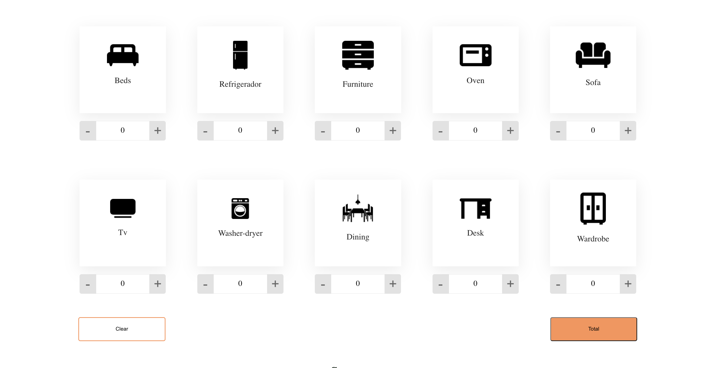
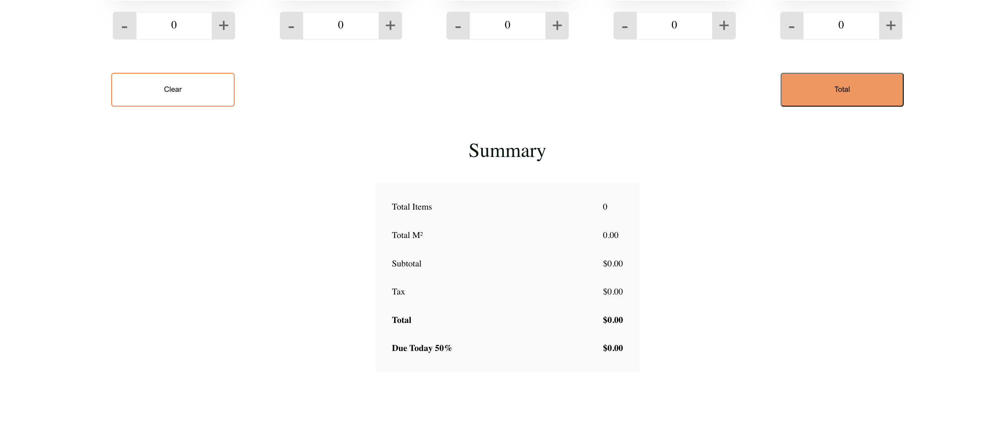

# Proficient Challenge


## Header


## Main Content



## Summary Section



## Footer


## Get Started

1. Clone this repository and run:
```sh
npm install
```
2. Run the web app:
```sh
npm run start
```


